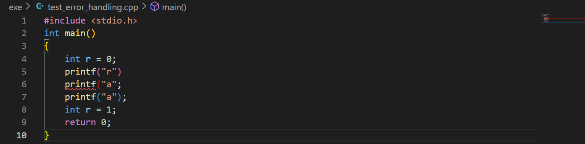
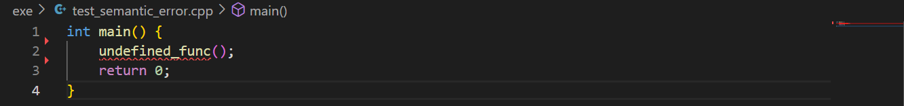
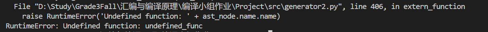

# cpp2llvm

Qi Ma ; Xinran Yu ;Junyu  Xu 

## Description of topic selection

Source language C++, target language LLVM IR, using python-lex-yacc. Only part of the syntax of C++ is implemented.

## Configuration Environment

Both are encoded in UTF-8. If you only want to generate IR and not run IR, skip the "Method 1" section and see the configuration environment method (2)

### method 1

OS: ubuntu 20.04

#### install llvm

```
sudo apt-get install clang
```

```
sudo apt-get install llvm
```

The llvm version we installed on ubuntu20.04 is 10.0.0, and the clang version is 10.0.0-4ubuntu1

#### Install llvmlite

Install the llvmlite corresponding to the llvm version, the corresponding table can be seen [here] (https://pypi.org/project/llvmlite/), for example, check the table to know that llvm10.0.0 corresponds to llvmlite 0.6.0

```
wget https://github.com/numba/llvmlite/archive/refs/tags/v0.36.0.tar.gz
```

```
tar -xvf v0.36.0.tar.gz
```

```
cd llvmlite-0.36.0/
```

```
sudo LLVM_CONFIG_PATH=/path/to/your/llvm/bin/llvm-config-3.8 python3 setup.py install
```

#### Install PLY

```
pip install PLY
```

### Method 2

If only generate IR, do not run IR

```bash
pip install PLY
pip install llvmlite
```

## Instructions

+ lexical analysis

``` bash
python src/lex.py [path of cpp file]
```

The program will output a stream of tokens, which you can store in a text file with a directional character:

``` bash
python src/lex.py KMP.cpp > token.txt
```

+ generate syntax tree

```bash
python src/myYacc3.py source file path [target storage path (optional)]
```

If the third parameter is not specified, it will be stored in the 'source file path'_ast.json

+ generate llvm ir

```bash
python src/cpp2llvm.py source file path [target storage path (optional)]
```

If the third parameter is not specified, it will be stored in the 'source file path'_llvm.ll
To generate syntax tree to json file at the same time

```bash
python src/cpp2llvm.py source file path target storage path (required) --show
```

The json format file of AST will be stored in the 'source file path'_ast.json

+ run IR file

``` bash
lli [IR file path]
```

## Supported features

Passed the four basic tests of four operations, string matching, sorting, and palindrome detection. Support `scanf`, `printf`, `gets`, `atoi`, `isdigit`, `strlen` functions.

Supported advanced features are:

+ supports multidimensional arrays
+ Support scope mechanism
+ Perfect error handling, when an error is detected, it will not stop immediately, but will continue to compile.
+ Support preprocessing (#include and #define)

## Difficulties and innovations

### lexical analysis

The difficulty and innovation point is preprocessing. Currently it can handle include and define. For a custom header file, such as "myheader.h", we can **recursively** paste the function definition of the header file into the source file in the preprocessing. For the standard library header file, we skip it directly, and use the library function (such as scanf) as a function node directly. When generating the intermediate code, use the declare_intrinsic function of llvmlite to call the built-in scanf of llvm according to the interface specification of llvm.

### Gramma analysis

At this stage, we mainly write grammar rules according to the grammar stipulated by C99, and there is no room for flexibility, such as section A.2.1 of the appendix of the C99 standard document ([ISO/IEC 9899:1999](https://www.dii.uchile.cl /~daespino/files/Iso_C_1999_definition.pdf) Appendix A.2 Phrase structure grammar, page 408), specifies *primary-expression* (basic expression), *postfix-expression* (postfix expression), *argument-expression -list* (argument expression list), *unary-expression* (unary expression), etc., we only need to write grammar rules according to the specification.

### Error Handling

##### Check for syntax errors

Handle errors in the `p_error(p)` function of the `src/myYacc.py` file, output the error type and line number when an error is detected, and then call `parser.errok()` to set the state of the parser In an error-free state, the parser will discard the error token and continue to analyze downwards, **reporting all detected errors** instead of stopping after the first error is detected.

The syntax error checks implemented are: check whether the brackets match, check whether the semicolon is missing

Example of error reporting:




##### Check for semantic errors

In the `src/generator.py` file, by means of `raise RuntimeError`, when an error is detected, the error specific information is reported and stopped.

The implemented semantic error checks are: use of undefined variable, use of undefined function, use of undefined data type, use of undefined binary operator, repeated declaration of variable.

Example of error reporting:






## Test case and result verification

in the exe directory

+ arithmetic.cpp: Four arithmetic calculations
+ KMP.cpp: KMP string matching
+ myRank.cpp: sorting
+ palindrome.cpp: palindrome detection
+ test_preprocess.cpp: Test preprocessing #include and #define, the program includes the fun function defined in myheader.h into test_preprocess.cpp, prints the return value 666 of calling fun, prints #define and replaces T with 6 result
+ myArray.cpp: Verify support for high-dimensional arrays, input two two-dimensional arrays and calculate the product (enter 4 numbers each time, separated by spaces).
+ scope.cpp: test scope mechanism
+ test_error_handling.cpp: test to check for syntax errors, see the previous section `Error Handling` for the results
+ test_semantic_error.cpp: The test checks for semantic errors, see the previous section `Error Handling` for the results

Test Methods:

Refer to the usage method in the second section of this document, use `cpp2llvm.py` to compile the above `.cpp` test file into a `.ll` file (IR format), and then execute

```
lli arithmetic_llvm.ll
```

The ll file of the above test file has been generated in the `exe` directory.

## Division of Labor

|           | Lexical Analysis Phase                                       | Syntax Analysis Phase | Intermediate Code Generation                            |
| --------- | ------------------------------------------------------------ | --------------------- | ------------------------------------------------------- |
| Ma Qi     | Building a framework, constants, comments, error handling in lexical analysis, preprocessing | Writing grammar rules | Writing code generation rules, writing documents        |
| Junyu Xu  | Arithmetic operations in lexical analysis, test case writing (sorting, palindrome detection) | Writing grammar rules | Writing code generation rules, writing test files       |
| Yu Xinran | C++ reserved keywords in lexical analysis, test case writing (four arithmetic calculations, string matching) | Writing grammar rules | Writing code generation rules to realize error handling |

## Reference

https://github.com/Jmq14/c2llvm-compiler

https://github.com/wish142857/iTranslator-C2P/

https://github.com/alcides/pascal-in-python/

C99 standard: https://www.dii.uchile.cl/~daespino/files/Iso_C_1999_definition.pdf

Interpretation of the C99 standard: https://blog.csdn.net/weixin_44567318/article/details/117322765

llvmlite documentation: https://llvmlite.readthedocs.io/en/latest/

## Author

+ Qi Ma ( mq19 AT mails DOT tsinghua DOT edu DOT cn)
+ Xinran Yu
+ Junyu Xu 