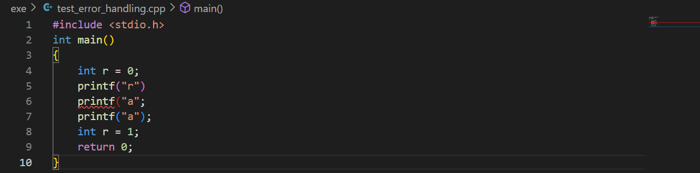
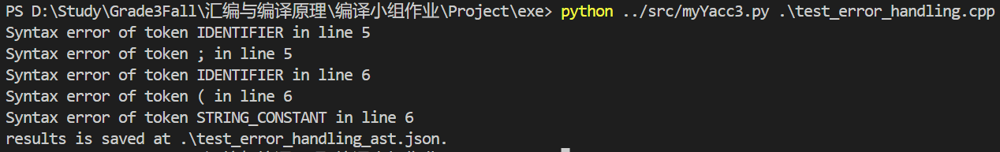
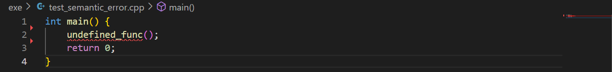
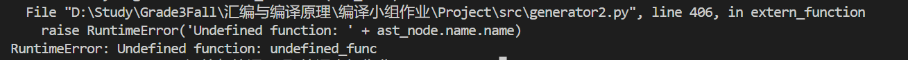

# cpp2llvm

马骐 ；余欣然 ；许钧愉 

## 选题说明

源语言C++，目标语言LLVM IR，使用python-lex-yacc。仅实现C++的部分语法。

## 配置环境

均采用UTF-8编码。如果只要生成IR，不运行IR，跳过“方法1”小节，看配置环境方法(2)
### 方法1
操作系统：ubuntu 20.04
#### 安装 llvm
```
sudo apt-get install clang
```

```
sudo apt-get install llvm
```

我们在ubuntu20.04安装的llvm版本是10.0.0， clang 版本是 10.0.0-4ubuntu1 

#### 安装 llvmlite

安装与llvm版本对应的llvmlite，对应表可以看[这里](https://pypi.org/project/llvmlite/)，例如查表知llvm10.0.0对应llvmlite 0.6.0

```
wget https://github.com/numba/llvmlite/archive/refs/tags/v0.36.0.tar.gz
```

```
tar -xvf v0.36.0.tar.gz 
```

```
cd llvmlite-0.36.0/
```

```
sudo LLVM_CONFIG_PATH=/path/to/your/llvm/bin/llvm-config-3.8 python3 setup.py install
```

#### 安装 PLY

```
pip install PLY
```

### 方法2
如果只要生成IR，不运行IR
```bash
pip install PLY
pip install llvmlite
```
## 使用方法
+ 词法分析

``` bash
python src/lex.py [path of cpp file]
```

程序将输出token流，您可以用定向符把它存储到文本文件里：

``` bash
python src/lex.py KMP.cpp > token.txt
```
+ 生成语法树
```bash
python src/myYacc3.py 源文件路径 [目标存储路径(可选)]
```
不指定第三个参数的话，会存储到'源文件路径'_ast.json
+ 生成llvm ir
```bash
python src/cpp2llvm.py 源文件路径 [目标存储路径(可选)]
```
不指定第三个参数的话，会存储到'源文件路径'_llvm.ll
要想同时生成语法树到json文件

```bash
python src/cpp2llvm.py 源文件路径 目标存储路径(必选) --show
```
AST的json格式文件会存储到'源文件路径'_ast.json

+ 运行IR文件
``` bash
lli [IR文件路径]
```
## 支持的功能

通过了四则运算、字符串匹配、排序、回文检测四个基础性测试。支持`scanf`，`printf`，`gets`，`atoi`，`isdigit`，`strlen`函数。

支持的高级功能有：

+ 支持多维数组
+ 支持作用域机制
+ 完善的错误处理，当检测到一个错误时不会立即停下，而是会继续进行编译。
+ 支持预处理（#include和#define)

## 难点与创新点

### 词法分析

难点和创新点是进行预处理。目前能处理include和define。对于自定义的头文件，例如"myheader.h"，我们可以在预处理中**递归**地把头文件的函数定义粘贴到源文件中。对于标准库头文件，我们直接跳过，对用到的库函数（例如scanf）直接当成一个函数节点，在生成中间代码时，使用llvmlite的declare_intrinsic函数遵照llvm的接口规范调用llvm内置的scanf。

### 语法分析

这一阶段我们主要根据C99规定的语法编写语法规则，没有什么灵活的空间，比如C99标准文档附录 A.2.1小节（[ISO/IEC 9899:1999 ](https://www.dii.uchile.cl/~daespino/files/Iso_C_1999_definition.pdf) 附录A.2 Phrase structure grammar,408页），规定了*primary-expression*（基本表达式），*postfix-expression*（后缀表达式），*argument-expression-list*（实参表达式列表），*unary-expression*（一元表达式）等等，我们只需要根据规范编写语法规则即可。

### 错误处理

##### 检查语法错误

在`src/myYacc.py`文件的`p_error(p)`函数中对错误进行处理，在检测到错误时输出错误类型及行号，之后调用`parser.errok()`，将parser的状态设置为未出错的状态，使得parser会丢弃该出错token并继续向下分析，**报出所有检测到的错误**，而非在检测到第一个错误后就停止。

实现的语法错误检查有：检查括号是否匹配、检查分号是否缺失

报错示例：





##### 检查语义错误

在`src/generator.py`文件中，通过`raise RuntimeError`的方式，在检测到错误时报出错误具体信息并停止。

实现的语义错误检查有：使用未定义的变量、使用未定义的函数、使用未定义的数据类型、使用未定义的二元运算符、重复声明变量。

报错示例：






## 测例及结果验证

在exe目录下

+ arithmetic.cpp:四则运算计算
+ KMP.cpp:KMP 字符串匹配
+ myRank.cpp:排序
+ palindrome.cpp:回文检测
+ test_preprocess.cpp：测试预处理#include和#define，程序将myheader.h中定义的fun函数include到test_preprocess.cpp中，打印调用fun的返回值666，打印#define将T都替换为6后的结果
+ myArray.cpp：验证对高维数组的支持，输入两个二维数组并计算乘积（每次输入4个数字，以空格间隔）。
+ scope.cpp：测试作用域机制
+ test_error_handling.cpp：测试检查语法错误，结果请见上一小节`错误处理`部分
+ test_semantic_error.cpp: 测试检查语义错误，结果请见上一小节`错误处理`部分

测试方法：

参考本文档第二小节的使用方法，用`cpp2llvm.py`将上述`.cpp`测试文件编译为`.ll`文件（IR格式），然后执行

```
lli arithmetic_llvm.ll
```

上述的测试文件的ll文件已经生成好在`exe`目录下。

## 分工

|        | 词法分析阶段                                                 | 语法分析阶段 | 中间代码生成                       |
| ------ | ------------------------------------------------------------ | ------------ | ---------------------------------- |
| 马骐   | 搭建框架，词法分析中的常量、注释、错误处理，预处理           | 编写语法规则 | 编写代码生成规则，撰写文档         |
| 许钧愉 | 词法分析中的算术运算，测试用例编写（排序，回文检测）         | 编写语法规则 | 编写代码生成规则，编写测试文件     |
| 余欣然 | 词法分析中的C++保留关键字，测试用例编写（四则运算计算，字符串匹配） | 编写语法规则 | 编写代码生成规则，实现错误处理功能 |

## 参考

https://github.com/Jmq14/c2llvm-compiler

https://github.com/wish142857/iTranslator-C2P/

https://github.com/alcides/pascal-in-python/

C99标准：https://www.dii.uchile.cl/~daespino/files/Iso_C_1999_definition.pdf

C99标准解读：https://blog.csdn.net/weixin_44567318/article/details/117322765

llvmlite文档：https://llvmlite.readthedocs.io/en/latest/